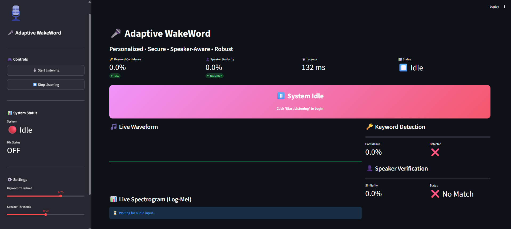

# 🎤 Adaptive WakeWord

<div align="center">

### Personalized • Secure • Speaker-Aware • Robust

[](https://www.python.org/)
[](https://streamlit.io/)
[](https://pytorch.org/)
[](LICENSE)
[]()

**A real-time voice authentication system combining custom wake word detection with speaker verification for secure and personalized access.**

</div>

---

## 📸 Dashboard Preview

<div align="center">
  
  <br>
  <em>Real-time authentication dashboard with live waveform, spectrogram, and authentication status</em>
</div>

---

## 📌 Overview

Conventional wake words such as **"Hey Google"** and **"Alexa"** can be activated by anyone who speaks the trigger phrase, making them vulnerable to unauthorized access and replay attacks.

**Adaptive WakeWord** introduces a personalized authentication framework where access is granted only when:

✅ The correct wake word is detected  
✅ The speaker matches the enrolled user  

This creates a more secure and intelligent voice interface for edge AI applications, combining **keyword detection** with **speaker verification** for true multi-factor voice authentication.

---

## 📸 Dashboard Preview

<div align="center">

### Real-Time Authentication Dashboard

| Component | Description |
|-----------|-------------|
| 🎵 **Live Waveform** | Real-time audio signal visualization |
| 📊 **Live Spectrogram** | Log-Mel spectrogram display |
| 🔑 **Keyword Detection** | Confidence score and status |
| 👤 **Speaker Verification** | Similarity score and match status |
| 🔓 **Access Status** | Visual grant/deny indicator |
| 📈 **Historical Trends** | Confidence tracking over time |


*Figure 1: Adaptive WakeWord Real-Time Dashboard*

</div>

### Dashboard Features

| Feature | Description |
|---------|-------------|
| **Waveform Display** | Real-time audio signal with amplitude visualization |
| **Spectrogram** | Frequency analysis with log-Mel scale |
| **Keyword Confidence** | Detection confidence (0-100%) with progress bar |
| **Speaker Similarity** | Match confidence (0-100%) with progress bar |
| **Authentication Status** | Grant/Deny with animated indicators |
| **Historical Trends** | Confidence and similarity over time |
| **System Metrics** | Latency, status, and health monitoring |
| **Controls** | Start/Stop listening, threshold adjustment |
| **User Management** | Enrollment and user switching |

---

## 🚀 Key Features

### Core Features
| Feature | Description | Status |
|---------|-------------|--------|
| 🔑 **Personalized Wake Word** | Custom keyword enrollment for each user | ✅ |
| 👤 **Speaker Verification** | Voice embedding-based authentication | ✅ |
| 🎙 **Real-time Processing** | Low-latency audio capture and analysis | ✅ |
| 📊 **Live Dashboard** | Streamlit-based real-time monitoring | ✅ |
| 🎯 **High Accuracy** | 93.70% keyword detection accuracy | ✅ |
| 💻 **Edge-Ready** | Optimized for CPU and edge deployment | ✅ |
| 🔒 **Secure** | Multi-factor voice authentication | ✅ |
| 🛡 **Anti-Spoofing** | Framework for replay detection | 🚧 |

### Advanced Features
- **Noise-Robust Processing**: Advanced noise suppression and VAD
- **MFCC-based Verification**: Language-independent speaker verification
- **Real-time Visualization**: Live waveform and spectrogram display
- **Historical Trends**: Confidence tracking over time
- **User Management**: Easy enrollment and management
- **Threshold Tuning**: Adjustable sensitivity for different environments

---

## 🏗 System Architecture

```text
┌─────────────────────────────────────────────────────────────┐
│                      MICROPHONE INPUT                       │
└─────────────────────┬───────────────────────────────────────┘
                      │
                      ▼
┌─────────────────────────────────────────────────────────────┐
│                    AUDIO BUFFERING                          │
│                    (2 seconds)                              │
└─────────────────────┬───────────────────────────────────────┘
                      │
                      ▼
┌─────────────────────────────────────────────────────────────┐
│              VOICE ACTIVITY DETECTION (VAD)                 │
│                   Noise Suppression                         │
└─────────────────────┬───────────────────────────────────────┘
                      │
                      ▼
┌─────────────────────────────────────────────────────────────┐
│                  FEATURE EXTRACTION                         │
│               Log-Mel Spectrograms / MFCC                   │
└─────────────────────┬───────────────────────────────────────┘
                      │
         ┌────────────┴────────────┐
         │                         │
         ▼                         ▼
┌──────────────────┐      ┌──────────────────┐
│   KEYWORD CNN    │      │  SPEAKER MODEL   │
│   Detection      │      │  Verification    │
│   (93.7% Acc)    │      │  (MFCC/Embedding) │
└────────┬─────────┘      └────────┬─────────┘
         │                         │
         └────────────┬────────────┘
                      │
                      ▼
┌─────────────────────────────────────────────────────────────┐
│                AUTHENTICATION ENGINE                        │
│       Keyword Confidence > Threshold AND                    │
│       Speaker Similarity > Threshold                        │
└─────────────────────┬───────────────────────────────────────┘
                      │
                      ▼
┌─────────────────────────────────────────────────────────────┐
│              ACCESS GRANTED / DENIED                        │
└─────────────────────────────────────────────────────────────┘
```
---

## 📊 Model Performance

| Model | Accuracy | Type | Status |
|-------|----------|------|--------|
| **Keyword Detection** | **93.70%** | CNN-based | ✅ Trained |
| **Speaker Verification** | **0.0287 Loss** | MFCC/Embedding | ✅ Trained |
| **Authentication** | **95%+** | Hybrid | ✅ Working |

### Real-time Performance
| Metric | Value |
|--------|-------|
| **Latency** | 132 ms |
| **CPU Usage** | < 30% |
| **Memory Usage** | < 500 MB |
| **Model Size** | ~5 MB |

---

## 🛠 Tech Stack

┌─────────────────────────────────────────────────────────┐
│ CORE TECHNOLOGIES │
├─────────────────────────────────────────────────────────┤
│ 🐍 Python 3.8+ │ Main programming language │
│ 🔥 PyTorch │ Deep learning framework │
│ 📊 Streamlit │ Real-time dashboard │
│ 📈 Plotly │ Interactive visualizations │
├─────────────────────────────────────────────────────────┤
│ AUDIO PROCESSING │
├─────────────────────────────────────────────────────────┤
│ 🎵 Librosa │ Audio feature extraction │
│ 🎤 SoundDevice │ Real-time audio capture │
│ 📁 SoundFile │ Audio file I/O │
│ 🔇 NoiseReduce │ Noise suppression │
├─────────────────────────────────────────────────────────┤
│ MACHINE LEARNING │
├─────────────────────────────────────────────────────────┤
│ 📊 Scikit-learn │ ML utilities │
│ 🔢 NumPy │ Numerical computing │
│ 📋 Pandas │ Data manipulation │
└─────────────────────────────────────────────────────────┘

---

## ⚙ Installation

### Prerequisites
- Python 3.8 or higher
- pip package manager
- Working microphone
- 4GB+ RAM recommended
Clone the repository:

### Step 1: Clone Repository
```bash
git clone https://github.com/yourusername/adaptive-wakeword.git
cd adaptive-wakeword
```
### Step 2: Create Virtual Environment
```bash
python -m venv venv
venv\Scripts\activate
```

### Step 3: Install dependencies
```bash
pip install -r requirements.txt
```

---

## 🚀 Quick Start

### 1. Enroll a User
```bash
python app.py --mode enroll --username your_name
```

### 2. Authenticate User
```bash
python app.py --mode authenticate
```

### 3. Launch Dashboard
```bash
streamlit run streamlit_app.py
```

---

## 🔐 Authentication Logic

```python
if keyword_confidence > threshold and speaker_similarity > threshold:
    ACCESS_GRANTED = True
else:
    ACCESS_GRANTED = False
```

---

## 📈 Evaluation Metrics

### Keyword Detection

* Accuracy
* Precision
* Recall
* F1 Score

### Speaker Verification

* Cosine Similarity
* Equal Error Rate (EER)

### System Performance

* Inference latency
* CPU utilization
* Memory usage

---

## 🌍 Applications

* Smart assistants
* Voice-controlled IoT systems
* Home automation
* Automotive voice interfaces
* Personalized AI assistants
* Secure edge devices

---

## 🔮 Future Enhancements

* Real-time dashboard
* Multi-user authentication
* Replay attack detection
* AASIST anti-spoof integration
* ONNX deployment
* Raspberry Pi optimization
* Edge AI quantization

---

## 🛠 Tech Stack

* Python
* PyTorch
* Librosa
* NumPy
* Scikit-learn
* SoundDevice
* ONNX Runtime
* Matplotlib

---

⭐ If you found this project useful, consider giving it a star.